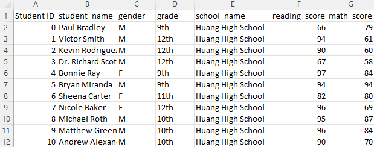
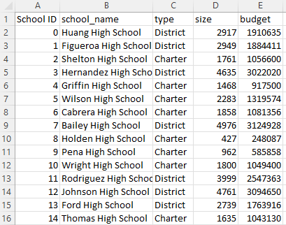
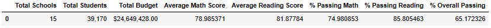
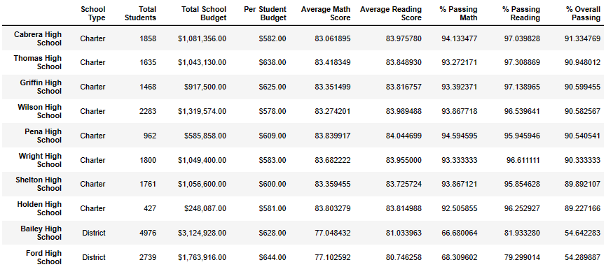
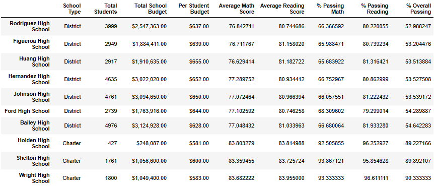
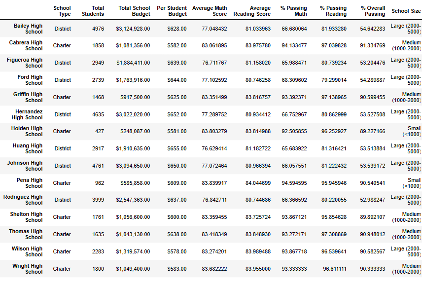
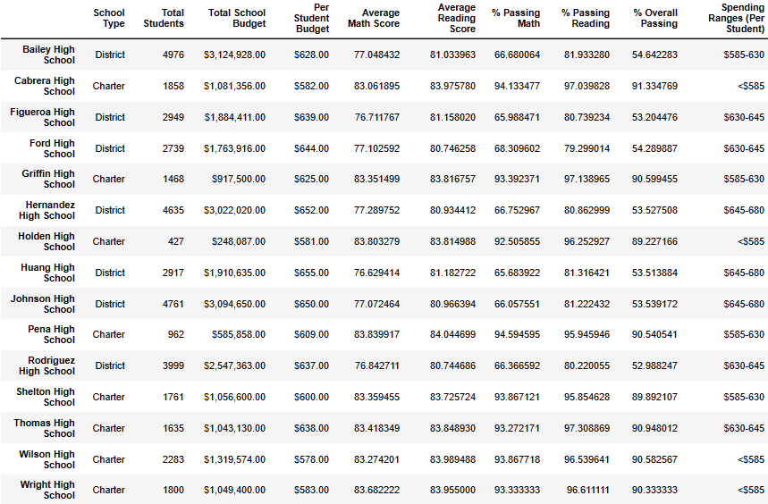
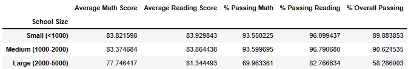
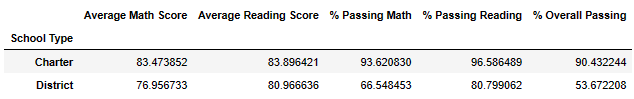
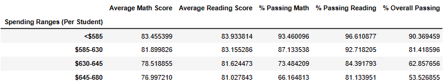

# School District Analysis with Pandas
This project aims to analyze data from a school district's public high schools and its students in order to find correlations between a school's size, type (district or charter), and spending per student, and the performance of its students. All calculations and aggregations were performed, stored, and displayed with the Pandas module in Python.

<h2>Raw Data</h2>

Student Data  
 

School Data  
 

<h2>Data Cleaning and Aggregation</h2>
Below are screenshots of the dataframes created within the 'main.ipynb' Jupyter Notebook script located in the PyCitySchools folder located in the main repository.

Summary of All Schools in the School District 
 

Summary of Each School in the School District (% Overall Passing in Descending Order)
 

Summary of Each School in the School District (% Overall Passing in Ascending Order)
 

Next, binning was used for School Size (the number of students) and Spending per Student (per student budget), resulting in the following two dataframes: 

Dataframe with binned School Size column: 
 

Dataframe with binned Spending Range column 
 

With the binned data from the previous two dataframes, it's possible to aggregate the data and look for correlations between a school's size, type, and per student budget and a school's performance, i.e. the average grades of students.

Performance Summary Broken Down by School Size 
 

Performance Summary Broken Down by School Type 
 

Performance Summary Broken Down by Spending per Student 
 

<h2>Analysis and Conclusions</h2>

- There is a significant disparity in the overall passing rates between charter schools and district schools, with charter schools having much higher overall passing rates than district schools. The top five schools (in terms of overall passing percentage) are all charter schools, while the bottom five schools are all district schools. This disparity becomes even more apparent when the overall passing percentages of the lowest ranked charter school and that of the highest ranked district school are compared directly. The lowest ranked charter school has an overall passing percentage of 90.6%, while the highest ranked district school has an overall passing percentage of 54.6%. Furthermore, charter schools, as a whole, have an overall passing percentage of 90.4%, while district schools have an overall passing percentage of only 53.7%. This means that roughly half of the students at district schools are not able to pass, defined as maintaining at least a 70% average, both reading and math classes. 

- The amount of money spent per student at a given school correlates negatively with said school’s overall passing percentage. Schools with a per student budget of less that $585, the lowest per student budget quartile in this analysis, outperform schools in every other budget range. Schools in the lowest budget range have an overall passing rate of 90.4%, while schools in the highest budget range have an overall passing rate of 53.5%, almost exactly mirroring the comparison of district and charter schools found in the first conclusion. 

- Small schools (less than 1000 students) and medium-sized schools (between 1000 and 2000 students) perform much better than large schools (between 2000 and 5000 students). Small and medium-sized schools have almost identical passing math rates, passing reading rates, and overall passing rates. Large schools, however, perform worse, with an overall passing rate of only 58.3%, compared to roughly 90% for small and medium-sized schools. Large schools perform particularly poorly in math, with a passing math rate of 70% compared to 93.6% for small and medium-sized skills. 

- School size, per student budget, and district/charter designation all correlate strongly with a school’s performance. However, pinpointing which of these three is the primary factor in a school’s performance is difficult due to the inherent limitations of the data set. For example, there is no data regarding the average class size at a given school. There is also no data regarding the socio-economic circumstances of students or that of the area surrounding each school.

